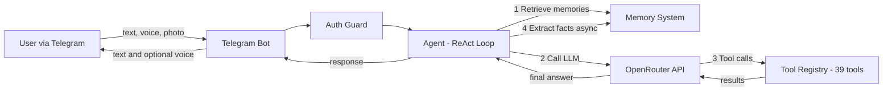

<div align="center">

# 🤖 GravityClaw

**A Personal Autonomous AI Agent with Persistent Memory**

[](https://www.typescriptlang.org/)
[](https://nodejs.org/)
[](https://core.telegram.org/bots)
[](LICENSE)

*An AI agent that lives in Telegram, remembers everything, and connects to your Google Workspace.*

</div>

---

## ✨ What is GravityClaw?

GravityClaw is more than a chatbot — it's a **fully autonomous AI agent** that runs locally on your machine and communicates through Telegram. It can:

- 🧠 **Remember** everything you tell it across sessions (Mem0-inspired memory)
- 🔧 **Use 39 tools** autonomously — files, shell, web search, email, calendar, and more
- 📧 **Manage your Gmail** — read, send, and reply to emails
- 📅 **Control your Calendar** — list, create, and delete events
- 📁 **Access Google Drive** — search, list, and read files
- 🗣️ **Talk to you** — voice input (Whisper) and voice output (ElevenLabs)
- 🎨 **Push live widgets** — charts, tables, and forms via a real-time web dashboard
- 🔐 **Stay secure** — encrypted secrets, user whitelisting, and Docker sandboxing

## 🏗️ Architecture



**The ReAct Loop** — GravityClaw uses an agentic Reason + Act loop (up to 10 iterations per message). The LLM autonomously decides which tools to call, chains their results, and extracts facts into long-term memory after every exchange.

## 🧠 Memory System

Inspired by [Mem0](https://mem0.ai), GravityClaw has a three-tier memory architecture:

| Tier | Storage | Purpose |
|------|---------|---------|
| **Working** | In-memory | Current conversation (auto-pruned) |
| **Episodic** | SQLite | Past conversation summaries |
| **Semantic** | SQLite + FTS5 + sqlite-vec | Extracted facts with vector + keyword search |

Before every response, GravityClaw performs **hybrid retrieval** across 4 sources: vector similarity, full-text keywords, knowledge graph, and episodic recall.

## 🔧 39 Tools

| Category | Tools |
|----------|-------|
| **Core** | `get_current_time` |
| **Memory** | `remember_fact`, `recall_facts`, `list_memories`, `forget_fact` |
| **Knowledge Graph** | `add_entity`, `add_relationship`, `query_graph` |
| **Notes** | `save_note`, `read_note`, `list_notes`, `delete_note` |
| **Files** | `read_file`, `write_file`, `list_directory`, `delete_file` |
| **System** | `run_shell_command` |
| **Web** | `web_search` |
| **Gmail** | `list_emails`, `read_email`, `send_email`, `reply_email` |
| **Calendar** | `list_calendar_events`, `create_calendar_event`, `delete_calendar_event` |
| **Drive** | `search_drive_files`, `list_drive_files`, `read_drive_file` |
| **Scheduler** | `schedule_task`, `list_scheduled_tasks`, `delete_scheduled_task` |
| **Secrets** | `store_secret`, `get_secret`, `list_secrets` |
| **Canvas** | `create_chart`, `create_table`, `create_form`, `push_html`, `clear_canvas` |

## 🚀 Quick Start

### 1. Clone & Install

```bash
git clone https://github.com/nonputtipong/GravityClaw.git
cd GravityClaw
npm install
```

### 2. Configure

```bash
cp .env.example .env
```

Fill in the required values:

```env
TELEGRAM_BOT_TOKEN=your_token_from_botfather
OPENROUTER_API_KEY=your_openrouter_key
ALLOWED_USER_IDS=your_telegram_user_id
```

### 3. (Optional) Connect Google Workspace

```bash
npm run gmail:auth
```

This opens your browser to grant Gmail, Calendar, and Drive access. Copy the refresh token into `.env`.

### 4. Run

```bash
npm run dev
```

## ⚙️ Configuration

| Variable | Required | Description |
|----------|----------|-------------|
| `TELEGRAM_BOT_TOKEN` | ✅ | From [@BotFather](https://t.me/BotFather) |
| `OPENROUTER_API_KEY` | ✅ | From [openrouter.ai](https://openrouter.ai) |
| `ALLOWED_USER_IDS` | ✅ | Comma-separated Telegram user IDs |
| `GROQ_API_KEY` | ❌ | Enables voice transcription (Whisper) |
| `ELEVENLABS_API_KEY` | ❌ | Enables voice replies (TTS) |
| `GMAIL_CLIENT_ID` | ❌ | Google OAuth — enables Gmail, Calendar, Drive |
| `GMAIL_CLIENT_SECRET` | ❌ | Google OAuth |
| `GMAIL_REFRESH_TOKEN` | ❌ | Google OAuth (obtained via `npm run gmail:auth`) |
| `MASTER_KEY` | ❌ | Enables AES-256-GCM encrypted secret storage |
| `SANDBOX_ENABLED` | ❌ | Enables Docker sandboxing for shell commands |
| `BRIEFING_TIME` | ❌ | Morning briefing time (default: `07:00`) |
| `CANVAS_PORT` | ❌ | Live Canvas port (default: `3001`) |

> Features degrade gracefully — only `TELEGRAM_BOT_TOKEN`, `OPENROUTER_API_KEY`, and `ALLOWED_USER_IDS` are required.

## 📁 Project Structure

```
src/
├── index.ts              # Entry point
├── agent.ts              # ReAct agentic loop
├── config.ts             # Environment config
├── guard.ts              # User whitelist
├── memory/               # 🧠 Mem0-inspired memory system
│   ├── sqlite.ts         # SQLite + FTS5 + sqlite-vec
│   ├── embeddings.ts     # Vector embeddings
│   ├── extraction.ts     # Fact extraction pipeline
│   ├── retrieval.ts      # Hybrid 4-source retrieval
│   └── knowledge_graph.ts
├── channels/             # 📡 Communication channels
│   ├── gmail.ts          # Gmail API
│   ├── calendar.ts       # Google Calendar API
│   └── drive.ts          # Google Drive API
├── tools/                # 🔧 39 tools
│   └── registry.ts       # Central tool registry
├── voice/                # 🗣️ Voice I/O
│   ├── transcribe.ts     # Groq Whisper STT
│   └── tts.ts            # ElevenLabs TTS
├── security/             # 🔐 Security
│   ├── secrets.ts        # AES-256-GCM vault
│   └── sandbox.ts        # Docker isolation
├── canvas/               # 🎨 Live Canvas (WebSocket)
├── proactive/            # ⏰ Morning briefing
├── scheduler/            # 📅 Cron task scheduler
└── mcp/                  # 🔌 MCP server bridge
```

## 🛠️ Tech Stack

| Component | Technology |
|-----------|-----------|
| Runtime | Node.js + TypeScript |
| LLM | OpenRouter (Gemini 2.0 Flash) |
| Telegram | grammY |
| Database | SQLite (better-sqlite3) + FTS5 + sqlite-vec |
| Voice | Groq Whisper + ElevenLabs |
| Google APIs | Native fetch + OAuth2 |
| Real-time | WebSocket (ws) |
| Scheduling | node-cron |
| Encryption | AES-256-GCM |

## 📜 Telegram Commands

| Command | Description |
|---------|-------------|
| `/start` | Show welcome message |
| `/status` | Bot status & stats |
| `/new` | New conversation |
| `/compact` | Compress context |
| `/model` | Switch LLM model |
| `/usage` | Token usage stats |
| `/talk` | Toggle voice replies |
| `/clear` | Reset conversation |

## 🔌 MCP Support

GravityClaw can connect to external [Model Context Protocol](https://modelcontextprotocol.io) servers. Create `mcp_servers.json` in the project root:

```json
{
  "servers": [
    {
      "name": "github",
      "command": "npx",
      "args": ["-y", "@anthropics/mcp-server-github"],
      "env": { "GITHUB_PERSONAL_ACCESS_TOKEN": "ghp_..." }
    }
  ]
}
```

Tools from connected MCP servers are automatically discovered and registered.

---

<div align="center">
  <sub>Built with ❤️ using TypeScript, grammY, and OpenRouter</sub>
</div>
